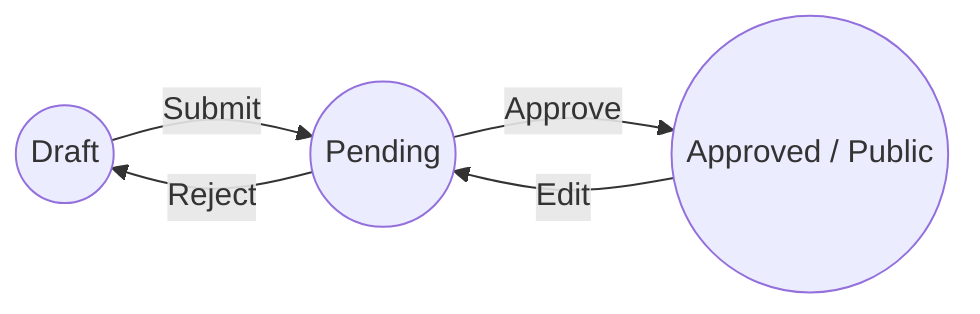

# BlogPlatform Pro 🚀

A modern, full-stack, production-inspired blogging platform designed with robust content moderation, strict version control, and real-time interactions.

### 🔴 Live Demo
- **Frontend (Vercel):** [https://blog.sujalshekhar.com/](https://blog.sujalshekhar.com/)
- **Backend API (Render):** [https://blog-platform-md24.onrender.com/docs](https://blog-platform-md24.onrender.com/docs)

## 🏗️ High-Level Architecture

```text
┌───────────────────────────────────────┐
│         Client (Web Browser)          │
│                                       │
│          [ React SPA (Vite) ]         │◄────── (Serves Static UI) ────── [Vercel CDN]
└────┬─────────────────────────────┬────┘
     │                             │
     │ WebSockets (Chat)           │ REST API (JSON)
     │ SSE (Notifications)         │
     ▼                             ▼
┌────────────────────────────────────────────────────────────────┐
│                   Backend (FastAPI on Render)                  │
│                                                                │
│  [REST API Handlers]  [WebSocket Manager]  [SSE Streamer]      │
└────────┬─────────────────────────────────────────────┬─────────┘
         │                                             │
         │ Read / Write                                │ Cache-Aside
         ▼                                             ▼
┌─────────────────┐                          ┌───────────────────┐
│                 │                          │                   │
│   PostgreSQL    │                          │    Redis Cache    │
│                 │                          │                   │
└─────────────────┘                          └───────────────────┘
```

## 🌟 Key Features

- **Role-Based Access Control (RBAC):** Distinct roles for `User`, `Approver`, and `Admin`.
- **Content Moderation Workflow:** Authors submit drafts -> Approvers/Admins review -> Approved blogs go live.
- **Strict Version Control:** Blogs are never overwritten. Every edit creates a new immutable version, preserving complete history.
- **Real-Time Discussion (Chat):** Live commenting on approved blogs via **WebSockets**.
- **Instant Notifications:** Server-Sent Events (**SSE**) instantly notify authors of approvals and admins of new submissions.
- **Interactive Feature Board:** Users can request features, and admins can update statuses.
- **Image Handling:** Blog cover images are referenced via external image URLs instead of being uploaded and stored directly by the application.

### 📝 Blog Lifecycle



---

## 🛠️ Tech Stack

### Frontend
- **Framework:** React 18 with Vite
- **Language:** TypeScript
- **Styling:** Tailwind CSS + Shadcn UI
- **State Management:** React Query (TanStack Query)
- **Routing:** React Router DOM

### Backend
- **Framework:** FastAPI (Python 3.10+)
- **ORM:** SQLAlchemy (Async/Sync hybrid)
- **Database:** PostgreSQL (Production ready)
- **Caching:** Redis
- **Real-Time:** WebSockets (Chat) & SSE (Notifications)
- **Security:** Passlib (Bcrypt) & Python-Jose (JWT)

---

## 🏛️ Project Structure (Backend)

The backend strictly follows a layered architecture to separate concerns:

```text
backend/
├── app/
│   ├── api/          # FastAPI routers and endpoint definitions
│   ├── core/         # Core config, security, and database session setup
│   ├── dependencies/ # Reusable FastAPI dependencies (auth, db sessions)
│   ├── enums/        # String enums for status, roles, and types
│   ├── models/       # SQLAlchemy declarative models (Database schema)
│   ├── repositories/ # Database interaction layer (CRUD operations)
│   ├── schemas/      # Pydantic models for request/response validation
│   ├── services/     # Core business logic and transaction orchestration
│   ├── sse/          # Server-Sent Events implementation for notifications
│   └── websocket/    # WebSocket connection manager for live chat
├── alembic/          # Database migration scripts
```

---

## 📐 Design Decisions

- **Controller-Service-Repository Architecture:** Decouples routing (API), business logic (Services), and database access (Repositories). This makes the codebase highly testable and allows complex transactions to be orchestrated gracefully in the service layer.
- **Strict Blog Versioning:** Instead of overwriting blog entries, every modification creates a new immutable version. This preserves historical integrity and allows for complete audit trails.
- **JWT Authentication & RBAC:** JWT provides stateless authentication. Role-Based Access Control (RBAC) is enforced through strict backend authorization dependencies on protected routes.
- **Single Transaction Principle:** Related database operations (such as blog submission and notification creation) are executed atomically to maintain consistency. Commits are performed at the service layer only after all related repository operations succeed.
- **Redis as Cache (Not Source of Truth):** Redis is used exclusively to cache blog detail retrieval using the **Cache-Aside pattern**. Cache invalidation occurs automatically on blog updates. It fails open—if Redis is unavailable, the application degrades gracefully and queries PostgreSQL directly.
- **Server-Sent Events (SSE) for Notifications:** Because notifications flow one-way (Server -> Client), SSE is used instead of WebSockets, significantly reducing overhead and improving battery life on mobile devices.
- **WebSockets for Chat:** WebSockets are reserved exclusively for bi-directional, high-frequency data exchange like live blog chat rooms.

---

## 🚀 Scaling Strategy

To evolve this architecture for millions of users, the following scaling paths are available:
1. **Horizontal API Scaling:** Deploy multiple FastAPI instances behind a load balancer (e.g., AWS ALB).
2. **Database Connection Pooling:** Using SQLAlchemy's connection pooling prevents excessive connections to PostgreSQL under high load by recycling a fixed pool of connections.
3. **Redis Pub/Sub for WebSockets:** Currently, WebSocket connections are stateful to a single instance. Integrating Redis Pub/Sub would allow real-time messages to be broadcasted across a fleet of stateless FastAPI workers.
4. **Database Read Replicas:** PostgreSQL can be scaled by routing read queries (e.g., fetching blogs) to read replicas while keeping writes on the primary node.
5. **Background Workers (Celery/RabbitMQ):** Offloading heavy tasks (like bulk email notifications) from the main event loop to background workers.

---

## 🔮 Future Improvements

While robust, several features were intentionally scoped out for the initial release and are prime candidates for future iterations:
- **Direct File Uploads:** Offloading image uploads directly from the client to cloud object storage (S3/Cloudinary) using pre-signed URLs, instead of relying on external URLs.
- **CDN Integration:** Serving media assets efficiently via a Content Delivery Network (CDN).
- **Refresh Tokens:** Implementing a short-lived access token / long-lived refresh token rotation mechanism.
- **Distributed WebSocket Scaling:** Implementing Redis Pub/Sub to scale WebSockets across multiple nodes.
- **Pending Revisions:** Keeping the previously approved version of a blog live while a new revision is awaiting approval.
- **Autosave Drafts:** Automatically saving drafts to Redis periodically.
- **Email Notifications:** Integrating SendGrid or AWS SES for off-platform notifications.

---

## 🚀 Setup & Run (Local Development)

### 1. Prerequisites
- **Node.js** (v18+)
- **Python** (3.10+)
- **PostgreSQL & Redis Server** (Running locally)

### 2. Backend Setup
```bash
cd backend
python3 -m venv venv
source venv/bin/activate
pip install -r requirements.txt
# Update .env with your local PostgreSQL and Redis URLs
uvicorn app.main:app --reload
```
*Backend runs on `http://127.0.0.1:8000`*

### 3. Frontend Setup
```bash
cd frontend
npm install
npm run dev
```
*Frontend runs on `http://localhost:5173`*

---

## 🧪 Testing

### Backend
Backend testing relies on FastAPI's `TestClient` combined with `pytest`.
```bash
cd backend
pytest -v
```

### Frontend
You can test components and hooks using standard Jest/React Testing Library setup.
```bash
cd frontend
npm run test
```

---

## 📚 API Documentation

### Swagger UI (`/docs`)
FastAPI automatically generates interactive OpenAPI documentation. Once the backend is running, visit:
**👉 [http://127.0.0.1:8000/docs](http://127.0.0.1:8000/docs)**

From there, you can view the schemas, read endpoint descriptions, and test requests directly in your browser.
